# Advanced Lane Detection

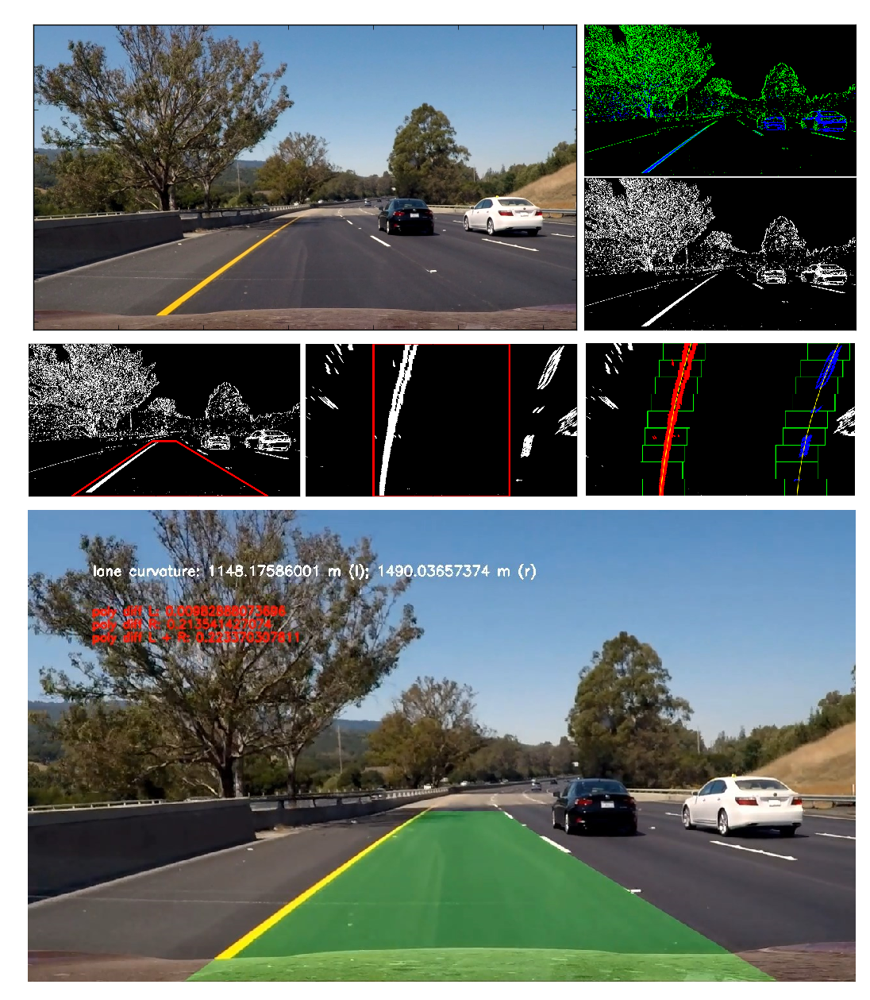

## Introduction

The goals / steps of this project are the following:

* Compute the camera calibration matrix and distortion coef?cients given a set of chessboard images.
* Apply a distortion correction to raw images.
* Use color transforms, gradients, etc., to create a thresholded binary image.
* Apply a perspective transform to rectify binary image ("bird's-eye view").
* Detect lane pixels and fit to find the lane boundary.
* Determine the curvature of the lane with respect to center.
* Warp the detected lane boundaries back onto the original image.
* Output visual display of the lane boundaries and numerical estimation of lane curvature.

Project files:

* IPython notebook [_advanced\_lane\_detection.ipynb_](advanced_lane_detection.ipynb), which contains all project code and additional commentary of the project implementation.
* Example output images for each stage of the processing pipeline in the [_output\_images_](output_images/) folder.
* Output video files in the [_output\_videos_](output_videos/) folder.

## Camera Calibration
#### Camera matrix and distortion coefficients
Camera lens can cause distortion to images and as result it can change the apparent size of an object in an image, object's shape and appearance may change depending on where it is in the field of view. Also, distortion can make objects appear closer or farther away than they actually are. That is why it is so important to compute camera calibration coefficients and to undistort images.
Code for this step is contained in the code cells 1, 2 of the project IPython notebook.
For each camera calibration image I am computing chessboard corners position using `cv2.findChessboardCorners`'function applied to the grayscaled original image. All found object and corner points stored in separate arrays which are then used as arguments for the `cv2.calibrateCamera`'function which produces calibration and distortion coefficients of the camera. Using these coefficients I am undistorting test calibration images using `cv2.undistort`'function, examples of output images are presented in the _output\_images/out\_calibration[N].jpg_ files.
Here is an example of output:

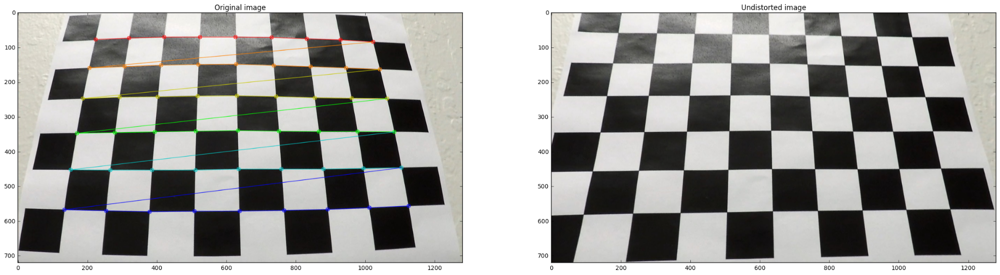

## Pipeline (test images)
#### Undistorting images
Code for this step contained it the code cell 3 of the IPython notebook
I am applying distortion and calibration coefficients for the camera obtained in the previous step  to test road images, using `cv2.undistort` function. Output images are in the _output\_images/calibrated\_[image\_name].jpg_ files.
Here is an example of the undistorted test image:

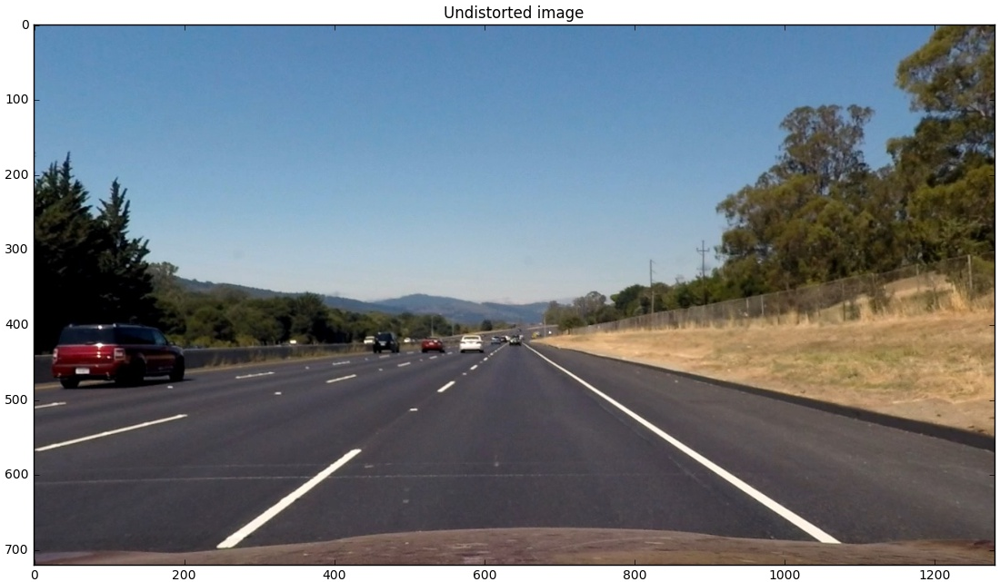

#### Color transforms & gradients. Thresholded binary image

Code for this step contained in the code cells 4 and 5 of the IPython Notebook.

Firstly, I'm creating a HLS color space version of the original image using `cv2.cvtColor(undist\_img, cv2.COLOR\_RGB2HLS)` and separating *S* channel, which contains a lot of information about possible lane lines on the image. After that I am computing absolute scaled Sobel derivative to accentuate lines away from horizontal using `cv2.Sobel` function. Using this derivative, I am computing threshold X gradient using threshold values in the range _(20, 100)_. I am doing the same thing for S color channel, thresholding it values in the range _(170, 255)_. So now I have two binary arrays, one for thresholded sobel derivative, and second for the S channel. Now I'm stacking these binary arrays into one binary array to produce binary image with highlighted possible lane lines. Output files are in the _output\_images/thresholds\_[image\_name].jpg_ files.
Here is an example of the original and resulting image after thresholding have been applied (on stacked thresholds image green color stands for Sobel derivative and blue for S channel threshold):

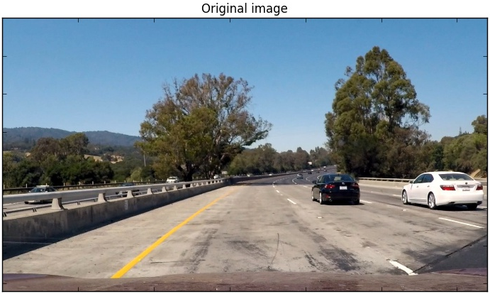
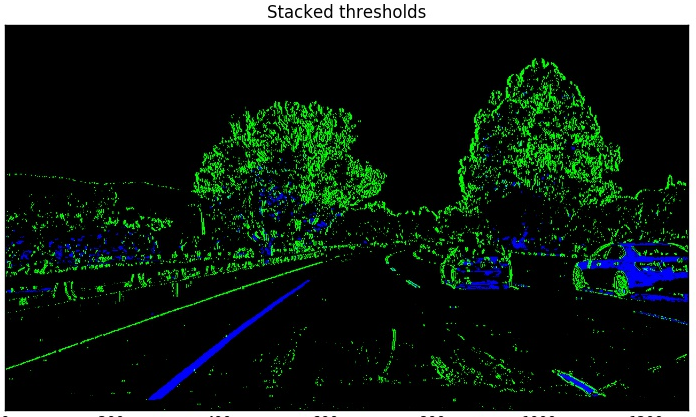
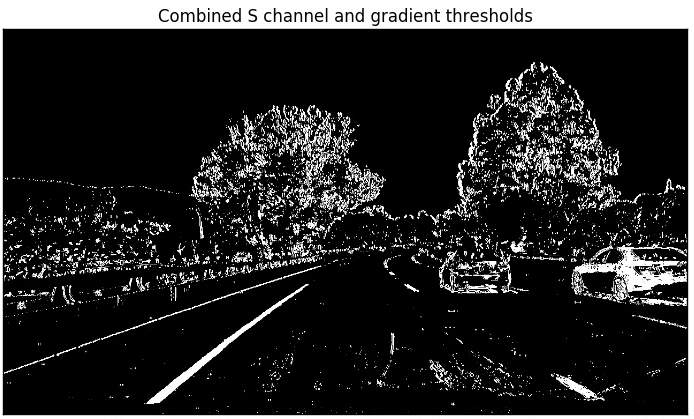

#### Perspective transform

Code for this step contained in the code cells 6 and 7 of the IPython Notebook.

To perform a perspective transform, I am using `cv2.getPerspectiveTransform` function applied to source and destination points coordinates, which produce matrix for perspective image transformation. Then I am using `cv2.warpPerspective` function to get warped image. Output files are in the _output\_images/perspective\_[image\_name].jpg_ files.
Before applying perspective transform, I perform image thresholding. Here is an example of what result image looks like with highlighted source and destination areas:

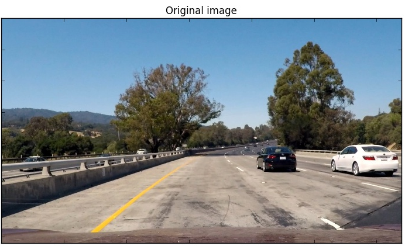
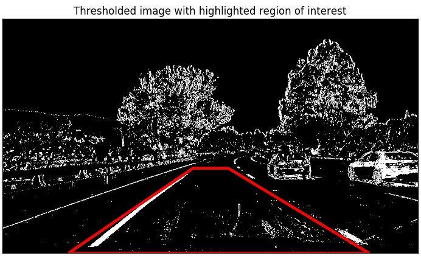
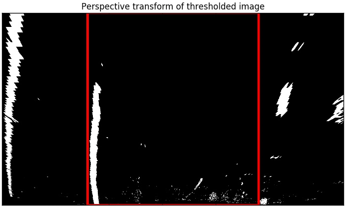

#### Fit a polynomial

Code for this step contained in the code cell 8 of the IPython Notebook.

After applying calibration, thresholding and a perspective transform to the road image, I have a binary image where the lane lines stand out clearly. To decide explicitly which pixels are part of the lines and which belong to the left line and which belong to the right line I first take a histogram along all the columns in the lower half of the image: `histogram = np.sum(binary\_warped[binary\_warped.shape[0]/2:,:], axis=0)` Then I find the peak of the left and right halves of the histogram. These will be the starting point for the left and right lines. After this I am defining sliding windows starting from these points and stepping through the windows one by one to identify non-zero pixels and append these indices to the line pixels lists. This allows me to extract left and right line pixels positions. Then I am fitting those positions into polynomial coefficients using `np.polyfit` function.
Output files are in the _output\_images/fit\_poly\_[image\_name].jpg_ files.
Here is example of output:

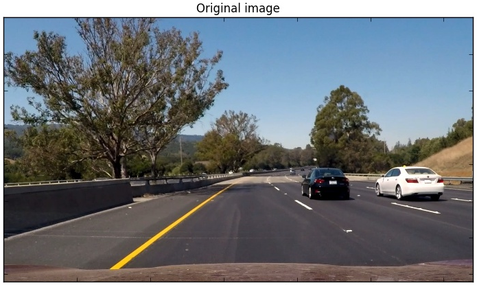
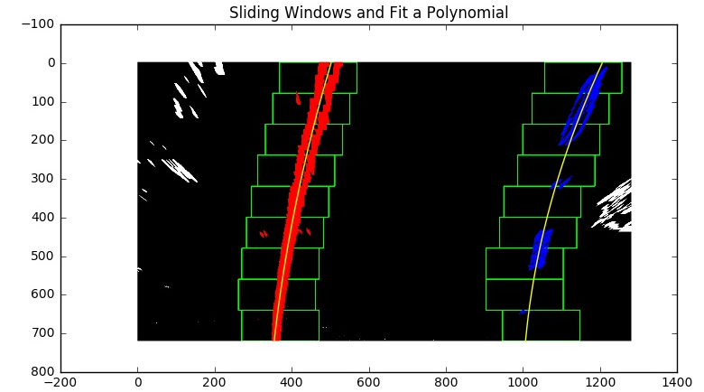

#### Radius of curvature of the lane and position of the vehicle

Code for this step contained in the code cell 11 of the IPython Notebook.

I have a polynomial coefficients for the lane lines functions. To find out a curvature of the lane I am simply using formula 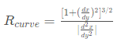'. Also, because I need to transform pixel image distance to meters, I use conversion coefficients for y = 30/720'and for x = 3.7/700 meters per pixels in y and x dimensions respectively.
To find out a car position relatively to the center of the lane I use bottom points of the lane lines functions, so now I know left and right border of the lane relatively to the car. Distance from the center of the image to lane border will define relative car position to the center of the lane. You can see lane curvature radius and relative car position being displayed on the result video output of the pipeline. Here is an example of the video stream image with the lane curvature and lane position being displayed in the top left corner:

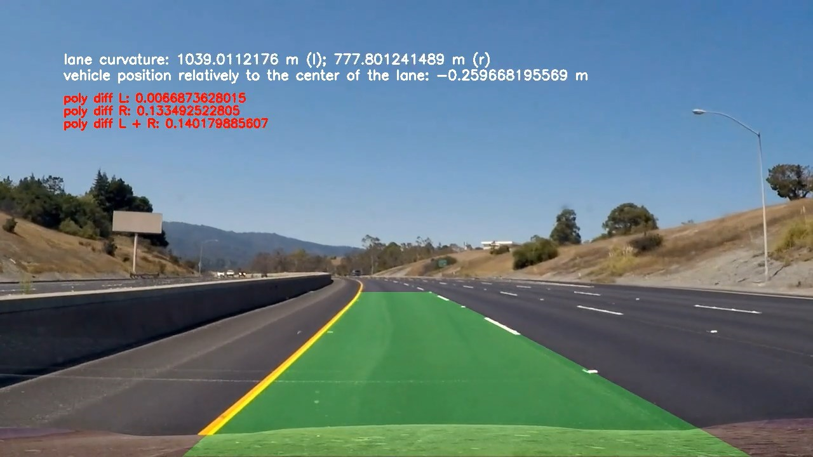

#### Plotting result back down onto the road

Code for this step contained in the code cell 8 of the IPython Notebook.

To project lane area back to the original image I use a backward warp function `cv2.warpPerspective` with inverted transform coefficients of the result lane projection. And then I use `cv2.addWeighted` function to highlight lane area on the original image.
Output files are in the _output\_images/fit\_poly\_[image\_name].jpg_ files.
Here is an example of original test image with projected lane area:

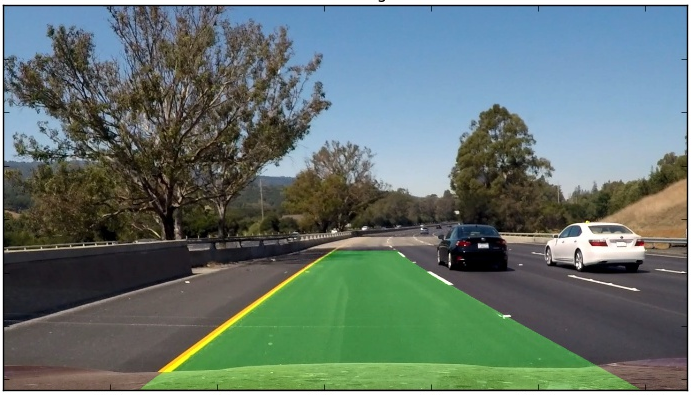

## Pipeline implementation (video)

#### Final video output

Video processing pipeline implementation code contained in the code cells 11 - 17 of the IPython Notebook.
Output files are in the _output\_videos_ folder.

[Resulting video](./output_videos/project_video_result.mp4)

## Final notes

Most time consuming issues are include fine-tuning perspective transform points coordinates. Also it is worth mentioning that thresholding range values also have to be picked up manually, and it is not an ordinary task, because even small difference make a big change for the resulting lane lines image.

Most likely my pipeline will fail on the videos with not clearly visible lane lines .

To make my pipeline more robust it is probably reasonable to implement more sophisticated lane lines search algorithm including advanced window search algorithm and implement outlier rejection and use a low-pass filter to smooth the lane detection over frames.
